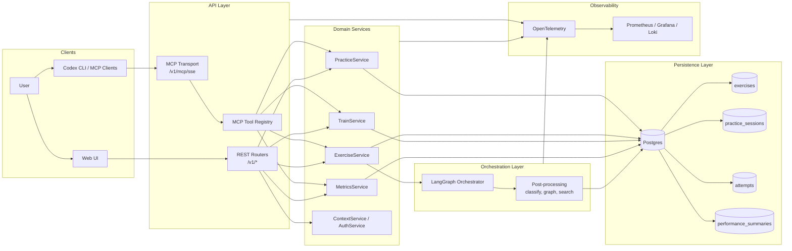
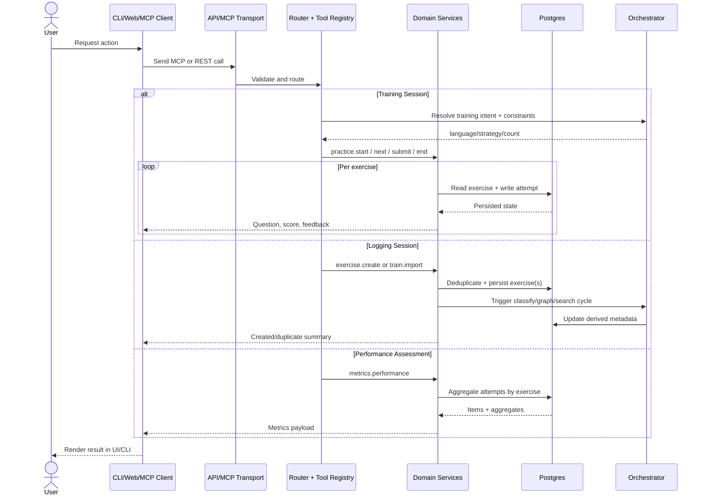
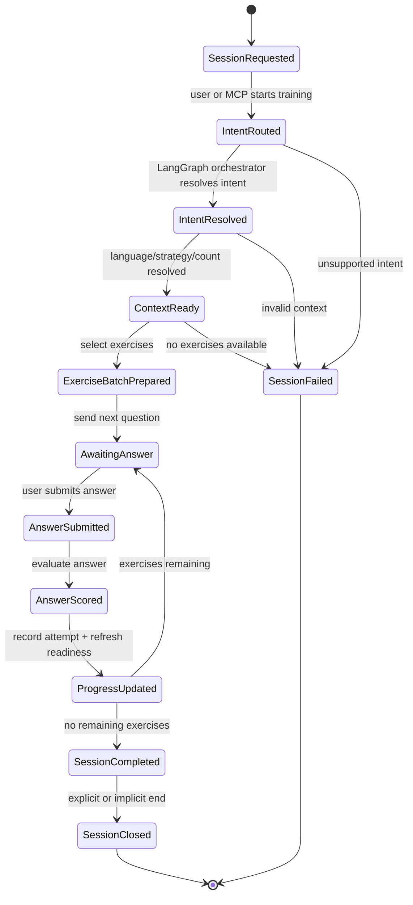
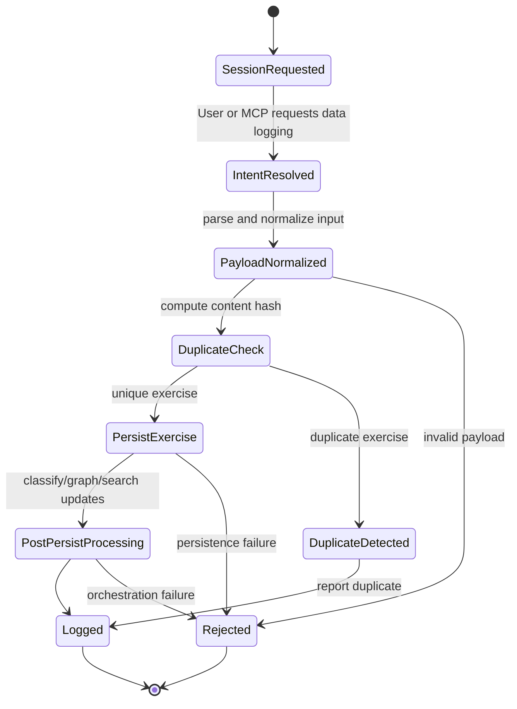
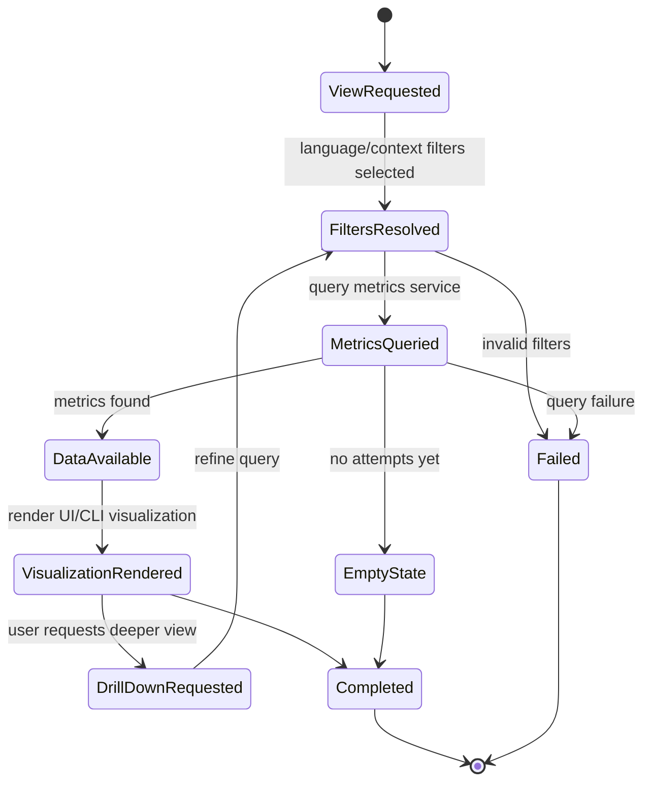

# Penrose-Lamarck

Live documentation: https://genentech.github.io/penrose-lamarck/

## Getting Started

Codex CLI MCP testing must be done from the host machine (outside devcontainer).

- `penroselamarck-local` (`http://localhost:8080/...`) is the supported endpoint for Codex CLI.
- `penroselamarck-api` hostnames are Docker-network/devcontainer-only and are not reachable from host-side Codex CLI.

### Local No-Auth Mode (`AUTH_DISABLED=true`)

For local development, set `AUTH_DISABLED=true` in [`src/penroselamarck/api/.env`](src/penroselamarck/api/.env) and run `db` + `api`.

In this mode:

- Codex should show `Auth: Unsupported` for `penroselamarck-local`.
- OAuth discovery probes may still be attempted by the MCP client and will return `404`.
- Those `404` responses are expected and do not indicate an API failure.

```sh
 ❯ codex
 ⚠ The penroselamarck-local MCP server is not logged in. Run `codex mcp login penroselamarck-local`.

 ⚠ MCP startup incomplete (failed: penroselamarck-local)
```

```sh
 ❯ codex mcp list
 Name            Url                                        Bearer Token Env Var  Status   Auth
 penroselamarck-local  http://localhost:8080/v1/mcp/sse  -                     enabled  Unsupported
```

```sh
 ❯ codex mcp login penroselamarck-local
 Authorize `penroselamarck-local` by opening this URL in your browser:
 https://...

 Successfully logged in to MCP server 'penroselamarck-local'.
```

```sh
 ❯ codex
 /mcp

 🔌  MCP Tools

   • penroselamarck-devcontainer
     • Status: enabled
     • Auth: Unsupported
     • URL: http://penroselamarck-api:8080/v1/mcp/sse
     • Tools: (none)
     • Resources: (none)
     • Resource templates: (none)

   • penroselamarck-local
     • Status: enabled
     • Auth: OAuth
     • URL: http://localhost:8080/v1/mcp/sse
     • Tools: auth_login, auth_me, exercise_classify, exercise_create, exercise_graph, exercise_list, exercise_search, metrics_performance, practice_end, practice_next, practice_start, practice_submit, study_context_get, study_context_set, train_import
     • Resources: (none)
     • Resource templates: (none)
```

If you see `penroselamarck-devcontainer` with `Auth: Unsupported` and `Tools: (none)`, keep using `penroselamarck-local` and optionally remove the stale entry:

```sh
 ❯ codex mcp remove penroselamarck-devcontainer
```

```sh
 ❯ codex mcp logout penroselamarck-local
```

## Conceptual Architecture and State Machines

This section explains how Penrose-Lamarck features behave conceptually, independent of client (web, MCP, CLI) and implementation details.

### Technical Architecture (Conceptual)



### Unified Runtime Flow (Conceptual)



### Training Session State Machine



### Logging Session State Machine



### Performance Assessment State Machine



## Candidate Implementation Backlog (Hiring Exercise)

Use the issue templates below to create implementation tickets that map 1:1 to the state machines.

| Area | State Machine Reference | Issue Template |
| --- | --- | --- |
| Training Session | [Training Session State Machine](#training-session-state-machine) | [.github/ISSUE_TEMPLATE/hiring-training-session-state-machine.md](.github/ISSUE_TEMPLATE/hiring-training-session-state-machine.md) |
| Logging Session | [Logging Session State Machine](#logging-session-state-machine) | [.github/ISSUE_TEMPLATE/hiring-logging-session-state-machine.md](.github/ISSUE_TEMPLATE/hiring-logging-session-state-machine.md) |
| Performance Assessment | [Performance Assessment State Machine](#performance-assessment-state-machine) | [.github/ISSUE_TEMPLATE/hiring-performance-assessment-state-machine.md](.github/ISSUE_TEMPLATE/hiring-performance-assessment-state-machine.md) |

# Penrose-Lamarck System Components

## Data Model

This model is practice-first: Penrose-Lamarck stores exercises, sessions, attempts, and per-exercise aggregates used by exercise selection and progress tracking.

URI convention (EpicShelter-style logic):
- URIs use a stable 3-part identifier pattern: `<namespace>:<entity>:<hash>`.
- Penrose-Lamarck namespace: `pluid`.
- Entity segment is table/model scoped (`exercise`, `practice-session`, `attempt`, `performance-summary`).
- Example format: `pluid:exercise:<hash>`.
- Schema note: URI columns were added in migration `20260228_000004_add_uri_to_models.py`.

### 1) Core Practice Model

1. `exercises`
- Purpose: Stores the canonical exercise bank (question/answer pairs plus metadata).
- ORM model: `src/penroselamarck/models/exercise.py` (`Exercise`).
- `id` PK (`String(64)`): Stable exercise identifier.
- `uri` (`String(512)`, NULL): Stable external resource URI (format: `pluid:exercise:<hash>`).
- `question` (`Text`, NOT NULL): Prompt shown to learners.
- `answer` (`Text`, NOT NULL): Canonical expected answer.
- `language` (`String(8)`, NOT NULL, indexed): Active language code used for filtering sessions/exercises.
- `tags` (`JSON`, NULL): Optional labels/categories used in retrieval or reporting.
- `classes` (`JSON`, NULL): Optional class/group names (added in migration `20260227_000003`).
- `content_hash` (`String(64)`, NOT NULL, UNIQUE, indexed): Deduplication fingerprint for normalized exercise content.
- `created_at` (`DateTime`, NOT NULL): Exercise creation timestamp.
- Relationship: one-to-many with `attempts`.
- Relationship: one-to-one with `performance_summaries`.

Example:
```json
{
  "exercise": {
    "id": "ex_da_001",
    "uri": "pluid:exercise:6ee4c2db8c24e4d9",
    "question": "Translate to Danish: \"hello\"",
    "answer": "hej",
    "language": "da",
    "tags": ["greetings", "vocabulary"],
    "classes": ["beginner", "core-lexicon"],
    "content_hash": "9b4d6f95d5c3f5c7f6c2a11f86a88f4f86f9d4a2f730f6b73d0be02c1ee11e0d",
    "created_at": "2026-02-27T09:30:00Z"
  }
}
```

2. `practice_sessions`
- Purpose: Stores one learner session configuration and lifecycle boundaries.
- ORM model: `src/penroselamarck/models/practice_session.py` (`PracticeSession`).
- `session_id` PK (`String(64)`): Stable session identifier.
- `uri` (`String(512)`, NULL): Stable external resource URI (format: `pluid:practice-session:<hash>`).
- `language` (`String(8)`, NOT NULL): Session language scope.
- `strategy` (`String(32)`, NOT NULL): Selection strategy key (schema docs mention examples like `weakest`, `spaced`, `mixed`).
- `target_count` (`Integer`, NOT NULL): Requested number of exercises.
- `status` (`String(16)`, NOT NULL): Session lifecycle state (schema docs mention `started` and `ended`).
- `started_at` (`DateTime`, NULL): Session start timestamp.
- `ended_at` (`DateTime`, NULL): Session end timestamp.
- `selected_exercise_ids` (`JSON`, NULL): Ordered exercise IDs selected for the session.
- Relationship: one-to-many with `attempts`.

Example:
```json
{
  "practice_session": {
    "session_id": "sess_20260227_0001",
    "uri": "pluid:practice-session:31d4c6447fabc912",
    "language": "da",
    "strategy": "mixed",
    "target_count": 5,
    "status": "started",
    "started_at": "2026-02-27T10:00:00Z",
    "ended_at": null,
    "selected_exercise_ids": ["ex_da_001", "ex_da_017", "ex_da_021", "ex_da_004", "ex_da_030"]
  }
}
```

3. `attempts`
- Purpose: Stores one evaluated learner answer for one exercise inside one session.
- ORM model: `src/penroselamarck/models/attempt.py` (`Attempt`).
- `id` PK (`String(64)`): Stable attempt identifier.
- `uri` (`String(512)`, NULL): Stable external resource URI (format: `pluid:attempt:<hash>`).
- `session_id` FK (`String(64)`, NOT NULL, indexed): References `practice_sessions.session_id`; `ON DELETE CASCADE`.
- `exercise_id` FK (`String(64)`, NOT NULL, indexed): References `exercises.id`; `ON DELETE CASCADE`.
- `user_answer` (`Text`, NOT NULL): Learner submitted answer.
- `score` (`Float`, NOT NULL): Numeric evaluation score (schema docs describe range `[0, 1]`).
- `passed` (`Boolean`, NOT NULL): Whether attempt met pass threshold.
- `evaluated_at` (`DateTime`, NOT NULL): Evaluation timestamp.
- Relationship: many-to-one to `practice_sessions`.
- Relationship: many-to-one to `exercises`.

Example:
```json
{
  "attempt": {
    "id": "att_20260227_00042",
    "uri": "pluid:attempt:f2ea71ad10b9cd5e",
    "session_id": "sess_20260227_0001",
    "exercise_id": "ex_da_001",
    "user_answer": "hej",
    "score": 1.0,
    "passed": true,
    "evaluated_at": "2026-02-27T10:02:03Z"
  }
}
```

4. `performance_summaries`
- Purpose: Stores denormalized per-exercise aggregates for fast selection/scoring workflows.
- ORM model: `src/penroselamarck/models/performance_summary.py` (`PerformanceSummary`).
- Added in migration `20260203_000002_add_performance_summary_and_fks.py`.
- `exercise_id` PK + FK (`String(64)`, NOT NULL): References `exercises.id`; `ON DELETE CASCADE`.
- `uri` (`String(512)`, NULL): Stable external resource URI (format: `pluid:performance-summary:<hash>`).
- `total_attempts` (`Integer`, NOT NULL): Count of attempts recorded for this exercise.
- `pass_rate` (`Float`, NOT NULL): Aggregate pass ratio for this exercise.
- `last_practiced_at` (`DateTime`, NULL): Timestamp of most recent attempt.
- Cardinality: exactly zero-or-one summary row per exercise.
- Relationship: one-to-one to `exercises`.

Example:
```json
{
  "performance_summary": {
    "exercise_id": "ex_da_001",
    "uri": "pluid:performance-summary:4f6a92c87d1140d3",
    "total_attempts": 12,
    "pass_rate": 0.83,
    "last_practiced_at": "2026-02-27T10:02:03Z"
  }
}
```

### 2) Relational Rules and Integrity

1. Referential integrity
- `attempts.session_id -> practice_sessions.session_id` with `ON DELETE CASCADE`.
- `attempts.exercise_id -> exercises.id` with `ON DELETE CASCADE`.
- `performance_summaries.exercise_id -> exercises.id` with `ON DELETE CASCADE`.

2. Deduplication and indexing
- Unique constraint: `uq_exercises_content_hash` on `exercises.content_hash`.
- Indexed fields used by retrieval flows:
  - `exercises.language`
  - `exercises.content_hash`
  - `attempts.session_id`
  - `attempts.exercise_id`

3. Lifecycle notes
- Practice sessions are mutable lifecycle records (`started_at`, `ended_at`, `status`).
- Attempts are append-only event rows (evaluations over time).
- Performance summaries are derived/aggregate rows that can be recomputed from attempts.

### 3) End-to-End Example

Example:
```json
{
  "exercise": {
    "id": "ex_da_001",
    "uri": "pluid:exercise:6ee4c2db8c24e4d9",
    "language": "da",
    "content_hash": "9b4d6f95d5c3f5c7f6c2a11f86a88f4f86f9d4a2f730f6b73d0be02c1ee11e0d"
  },
  "practice_session": {
    "session_id": "sess_20260227_0001",
    "uri": "pluid:practice-session:31d4c6447fabc912",
    "language": "da",
    "strategy": "mixed",
    "target_count": 5,
    "status": "ended"
  },
  "attempt": {
    "id": "att_20260227_00042",
    "uri": "pluid:attempt:f2ea71ad10b9cd5e",
    "session_id": "sess_20260227_0001",
    "exercise_id": "ex_da_001",
    "score": 1.0,
    "passed": true
  },
  "performance_summary": {
    "exercise_id": "ex_da_001",
    "uri": "pluid:performance-summary:4f6a92c87d1140d3",
    "total_attempts": 12,
    "pass_rate": 0.83
  }
}
```

## Contributing

[Fork](https://github.com/genentech/penrose-lamarck/fork) the project, pick an [issue](https://github.com/genentech/penrose-lamarck/issues) and submit a PR! We're looking forward to answering your questions on the issue thread.

## Commit Signing Across Repositories

Use the same SSH signing key in every local repo.

Example key:

- `/Users/pereid22/.ssh/gh_roche_ed25519.pub`

## Deterministic DB Mock Seeding

The Postgres container can seed deterministic mock data at runtime.

- Configure it in `src/penroselamarck/db/.env`.
- `DB_MOCK_DATA=true`: run deterministic seed module after migrations on startup.
- `DB_MOCK_DATA=false` (default): skip mock seeding.

Example:

```sh
# edit src/penroselamarck/db/.env and set DB_MOCK_DATA=true
docker compose up -d --build db api web
```

## TypeScript SDK

Penrose-Lamarck publishes a TypeScript SDK package:

- package: `@genentech/penroselamarck`
- registry: `npm.pkg.github.com`
- source path: `src/penroselamarck/sdk/ts`

Configure one repo:

```bash
cd /path/to/repo
git config --local gpg.format ssh
git config --local user.signingkey /Users/pereid22/.ssh/gh_roche_ed25519.pub
git config --local commit.gpgsign true
```

Apply to both repos in this workspace:

```bash
cd /Users/pereid22/source/epicshelter
git config --local gpg.format ssh
git config --local user.signingkey /Users/pereid22/.ssh/gh_roche_ed25519.pub
git config --local commit.gpgsign true

cd /Users/pereid22/source/penrose-lamarck
git config --local gpg.format ssh
git config --local user.signingkey /Users/pereid22/.ssh/gh_roche_ed25519.pub
git config --local commit.gpgsign true
```

Verify settings:

```bash
git config --show-origin --get gpg.format
git config --show-origin --get user.signingkey
git config --show-origin --get commit.gpgsign
```

If you use multiple GitHub accounts, switch the active `gh` account per repo:

```bash
gh auth switch -u pereid22_roche
gh auth switch -u diogobaltazar
```

If switching fails due to expired/invalid tokens, re-authenticate first:

```bash
gh auth login -h github.com -u pereid22_roche
gh auth login -h github.com -u diogobaltazar
```

## Applicants

If you're applying for a position in our team, having received an invitation from our Talent Partner, you have 7 days to submit your work. Upon a positive assessment, you'll be invited to the next steps of our recruitment process.

We sincerely wish you the best of luck and remain truly appreciative of any time you decide to put aside to working with us.

Yours sincerey,

The Hiring Team
